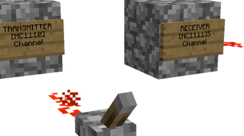

This IC allows receiving of redstone signals over long distances. The equivalent IC to transmit the signals is `1110 <1110.html>`_.

Sign parameters
===============

   1. Blank
   2. [1111]
   3. The channel name (Defined in `1110 <1110.html>`_)
   4. Optional wideband. Defaults to UUID if blank
   
How-To
======

Once you setup your sign, setup a `Transmitter <1110.html>`_ then you can power the Transmitter and watch the magic happen.

