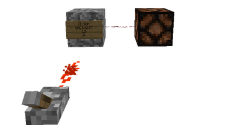

**1421** is an IC that allows for a precisely timed redstone signal.
The IC toggles between rising and falling states every X amount of ticks.

Sign parameters
===============
  2. [1421] or [1421]S
  3. Amount of redstone ticks between toggle
  4. Blank

    

